**需要完整代码可以加qq 931708230 或者加微信 wxid_r91ed6rslwdu22**

基于springboot的超市管理系统，java项目

推荐环境配置：eclipse/idea jdk1.8 maven mysql（需要远程可私聊）
主要技术：springboot，java，mysql，thyemleaf，shiro

主要功能：
商品管理：商品管理、分类管理、预警商品

进货管理：超市退货、供应商管理

库存管理：商品入库、商品出库

销售管理：销售订单、销售退货、客户管理

财务管理：财务分析

人事管理：部门管理、用户管理、请假管理、个人请假

系统设置：用户管理、角色管理、菜单管理、部门管理、岗位管理、日志管理

权限划分

超级管理员：拥有所有权限

销售人员：销售管理、库存管理

采购人员：商品管理、进货管理

人事：人事管理

普通员工：库存管理

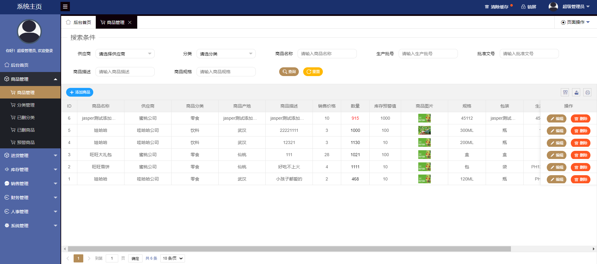

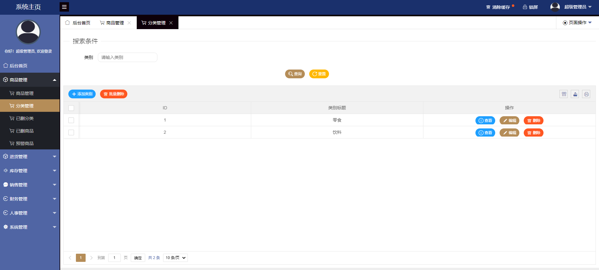

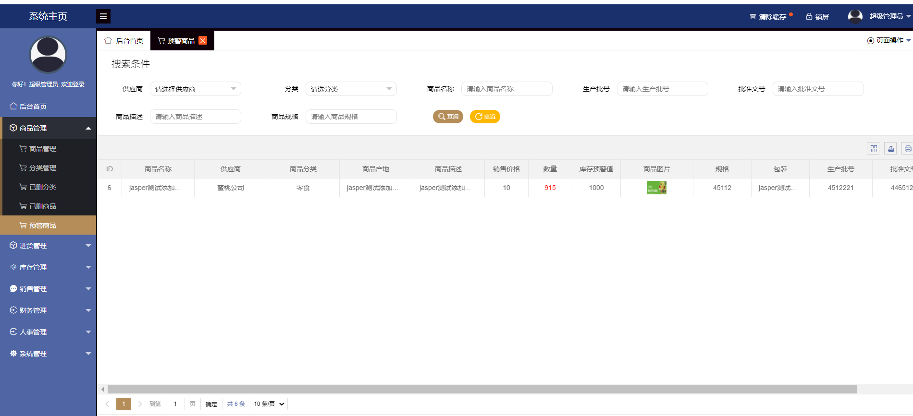

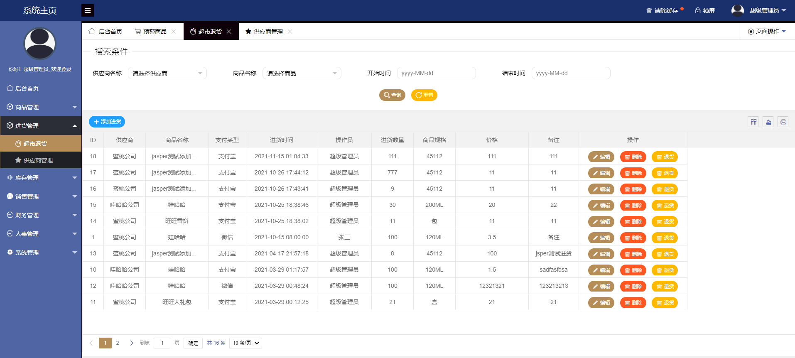

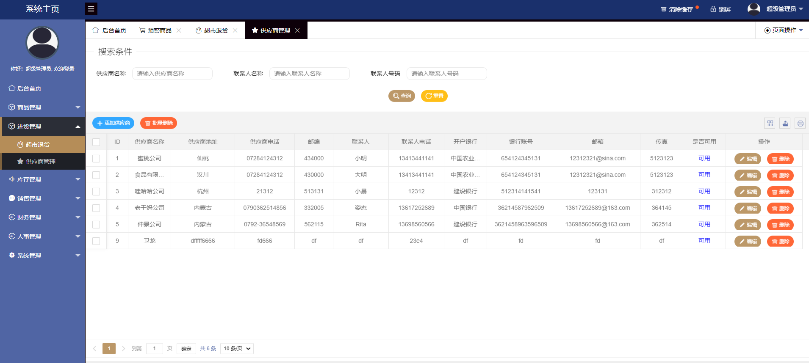

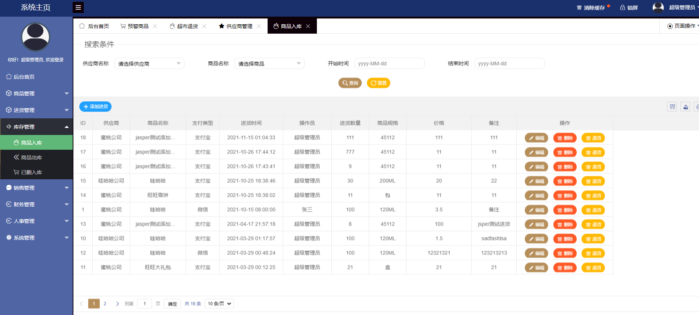

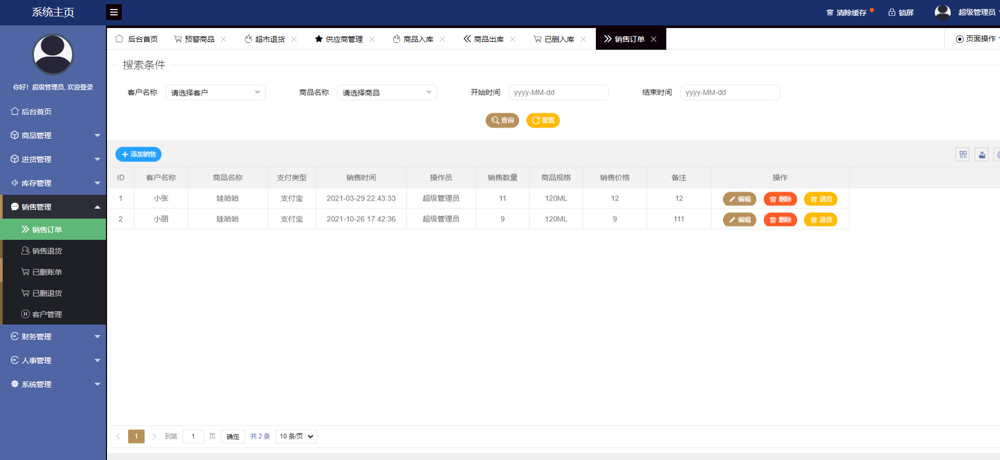

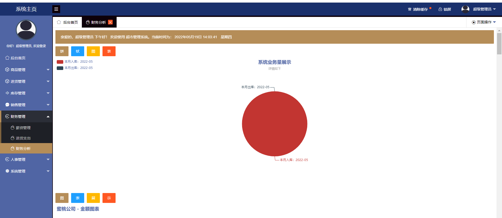

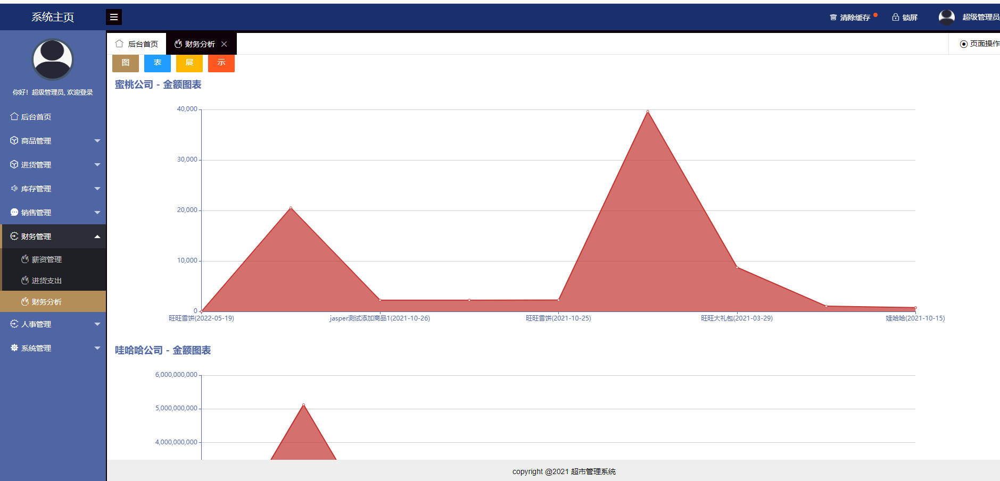

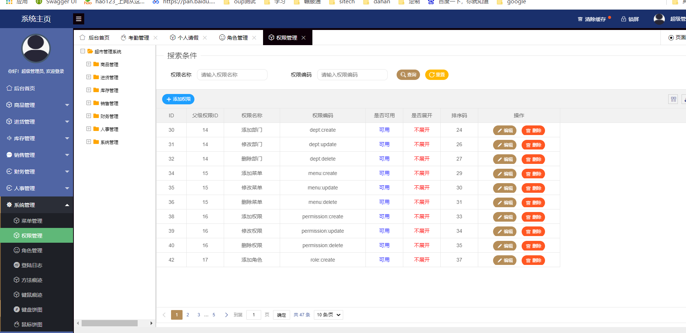

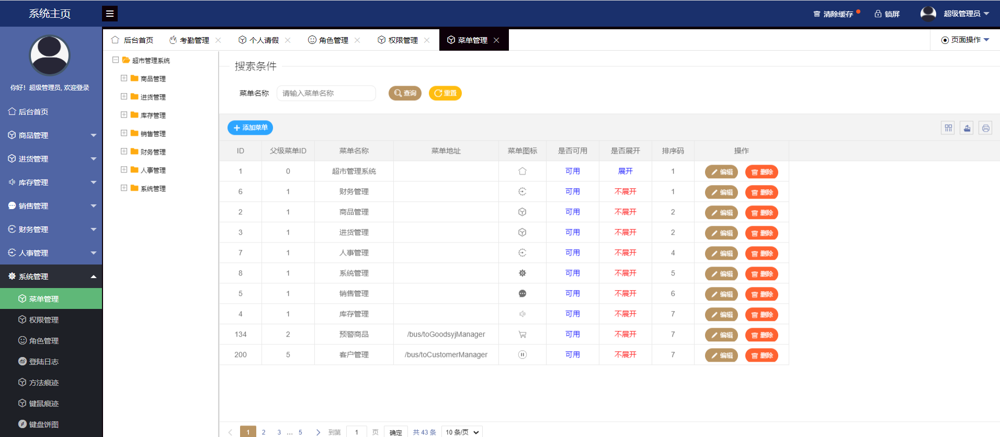

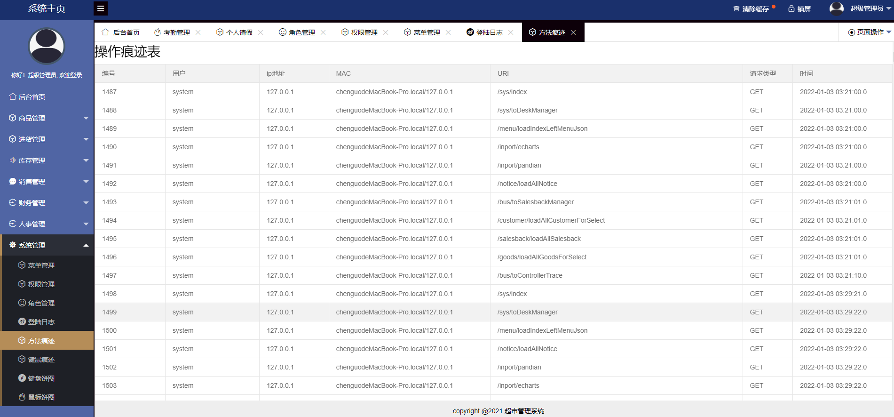

**需要完整代码可以加qq 931708230 或者加微信 wxid_r91ed6rslwdu22**
